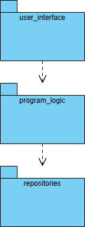

# Arkkitehtuuri

## Struktuuri

Peli koostuu kolmesta kerroksesta kuvan mukaisesti. Ylimmän kerroksen user_interface vastaa käyttöliittymästä, toisen kerroksen program_logic vastaa sovelluslogiikasta ja kolmannen kerroksen repositories vastaa sellaisen tiedon tallennuksesta, jonka on tarkoitus säilyä, kun peli käynnistetään uudelleen.