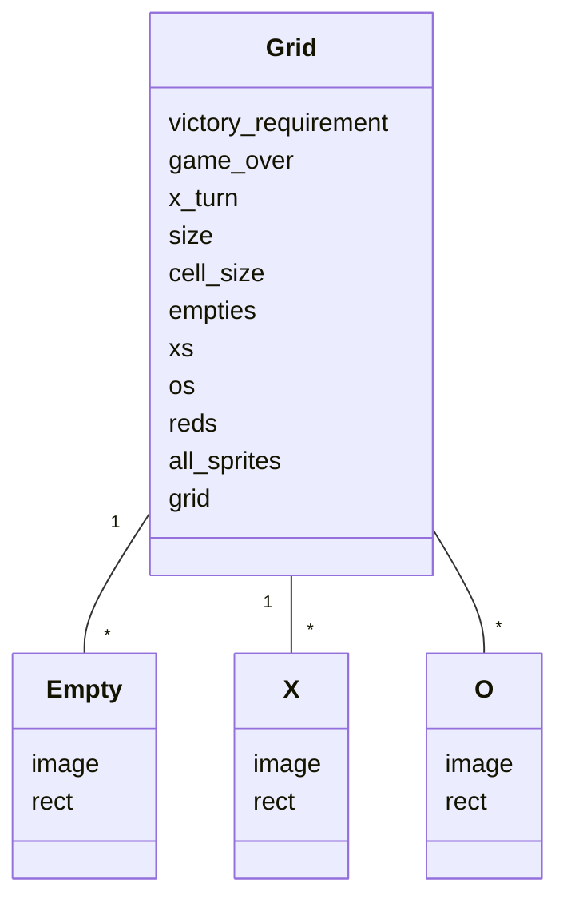

```mermaid
classDiagram
    Grid "1" -- "*" Empty
    Grid "1" -- "*" X
    Grid "1" -- "*" O
    class Grid{
        victory_requirement
        game_over
        x_turn
        size
        cell_size
        empties
        xs
        os
        reds
        all_sprites
        grid
    }
    class Empty{
        image
        rect
    }
    class X{
        image
        rect
    }
    class O{
        image
        rect
    }
```