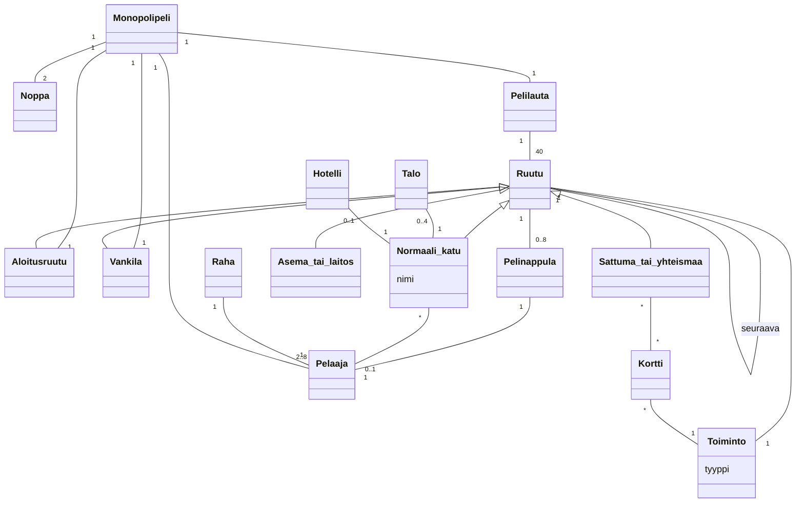

## Monopoli luokkakaavio

```mermaid
 classDiagram
    Monopolipeli "1" -- "2" Noppa
    Monopolipeli "1" -- "1" Pelilauta
    Monopolipeli "1" -- "1" Aloitusruutu
    Monopolipeli "1" -- "1" Vankila
    Pelilauta "1" -- "40" Ruutu
    Ruutu "1" -- "1" Ruutu : seuraava
    Ruutu "1" -- "0..8" Pelinappula
    Ruutu "*" -- "1" Toiminto
    Pelinappula "1" -- "1" Pelaaja
    Pelaaja "2..8" -- "1" Monopolipeli
    Ruutu <|-- Aloitusruutu
    Ruutu <|-- Vankila
    Ruutu <|-- Sattuma_tai_yhteismaa
    Ruutu <|-- Asema_tai_laitos
    Ruutu <|-- Normaali_katu
    Sattuma_tai_yhteismaa "*" -- "*" Kortti
    Kortti "*" -- "1" Toiminto
    Talo "0..4" -- "1" Normaali_katu
    Hotelli "0..1" -- "1" Normaali_katu
    Normaali_katu "*" -- "0..1" Pelaaja
    Raha "1" -- "1" Pelaaja
    class Normaali_katu{
        nimi
    }
    class Toiminto{
        tyyppi
    }
```